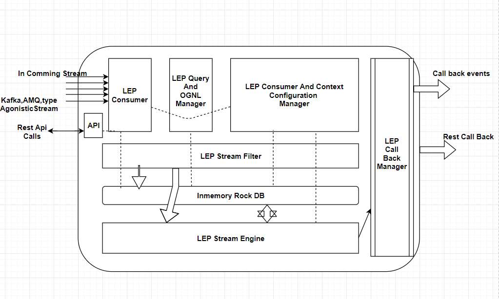

**Lightning Event Processor(LEP)**

LEP means Lightning event processor,LEP is basically designed to process large number of events and do farming with those events like counting/aggregation/reduction/merging/processing events on real-time basis.
Below all are separate modules can be used with no complete system dependency.

**LEP Consumer**
	Designed to consume confugured events from either from kafa cluster (OR) AMQ (OR) through REST APIs

**LEP Query And OGNL Manager**
	This module is for managing query associations,this will supports any query lanague like SPEL or OGNL or any custom quuery languge.

**LEP Stream Filter**

	Every time when your application may receive millions of events, but you are not bother about all those events, you need only few events which your campaigns or use cases are configured or running. So you need to filter those events easy configured way.
	But How, we can do with a registered query with that event type. And more over every CEP engine has its own query language to filter those events.
	We are designing our LEP not based on our own query language, we are going to design this component with SPEL (spring expression language) for every usecase Type,we associate one or more spel expressions. For every these particular type of events we apply registered spels against real-time events.

   Example Spel (A.0):
	((useCaseType matches 'REAL|OFFLINE') AND (customer Region matches 'IN|US') 
	AND (order Amount gt '10000') AND (productBuyTime between ('01-09-2017:22:01:00','02-09-2017:22:01:00')  
	AND (! ({11L, 12L}.contains All (itemIds))))

	For every customer who buys items from India/USA and order amount should >10000 and transaction time between some range and non-applicable items for this offer.
	Customers who satisfy this criteria get filtered.

**LEP Stream Engine**

	After filtering events we have to store or associate them to particular context for future usage,aggregations etc.
	Example (Refer Spel from the A.0)
 		In the above useCase mentioned in the 1.0, when customer meet that in ‘5’ times he has to get the 10% cashback on all the purchased amount.To satisfy this case, we need to create a aggregation Context for this window.

	WinterAgregationWindow (customer Name, currentNoOfTimes, expectedNoOfTimes, accumulatedPurchaseAmount)
	When every customer meets the A.0,we will populate this window and when it reaches the expected count, we will do the call back and initiate configured cash back.

Currently we are creating few predefined window templets for the usage.Predefined Windows examples:

	1)	EventAgregationCountWindow (event count should be 5 times and between time ranges )
	2)	EventAgregationBasedOnFields (in the event purchase amount and Time Ranges and no Discount)

Not only to have these we need to join between the windows, and do the aggregations or min, max etc.
Suppose we have two windows like WinterAgregationWindow and PurchaseAppAgregationWindow, in need give special cashback when customer meet the above two windows.

**Pattern Windows**
	LEP will do some kind of event correlation, these kinds of windows does not depend on single event it depends on series of events.
A Marketing Guru want to create series of campaign like (Camp1 cashback depends on camp2 and capm2 depends on camp3...etc.).
In this case we should listen series of dependent events to award cashback.
Basic pattern examples like 
i)	B event followed by A.
ii)	C followed by A,B
iii)	Not at all A,B,C
iv)	Series of 10 events.

 

